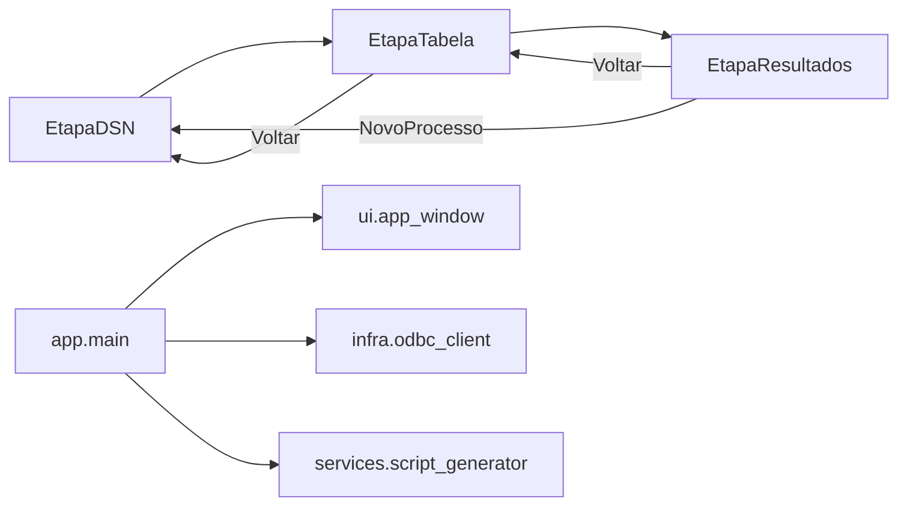

# Totvs Helper

Ferramenta desktop em Python para apoiar a criação de cargas ETL de tabelas TOTVS (Progress/OpenEdge), gerando scripts de apoio para SQL Server e SSIS.

**Desenvolvido para [Britânia Eletrodomésticos](https://www.britania.com.br/).**

## Distribuição interna (Britânia)

Os executáveis (**`TotvsHelper_64b.exe`** e, se necessário, **`TotvsHelper_32b.exe`**) e o arquivo **`.env`** (credenciais ODBC) usados no dia a dia ficam na rede interna da Britânia, no diretório:

`P:\TECNOLOGIA DA INFORMACAO\SISTEMAS\Desenvolvimento TI\Desenvolvimento Externo\dados\TOTVS HELPER`

- Execute o programa a partir desse caminho (ou atalho apontando para ele).
- Use **`TotvsHelper_64b.exe`** quando os DSNs OpenEdge estiverem no ODBC **64 bits** (`C:\Windows\System32\odbcad32.exe`). Use **`TotvsHelper_32b.exe`** se os DSNs existirem apenas no ODBC **32 bits** (`SysWOW64\odbcad32.exe`).
- Alterações de credenciais devem ser feitas no `.env` dessa pasta; o arquivo **não** é versionado neste repositório.
- Para desenvolvimento ou novo build, use `.env.example` na raiz do projeto como modelo.

Logs da aplicação (rotativos): `%APPDATA%\TotvsHelper\logs\totvs_helper.log`

## Interface (CustomTkinter)

A aplicação usa uma **única janela** com fluxo em etapas, sem precisar fechar e reabrir o programa:

1. **Conexão ODBC** — lista DSNs OpenEdge com busca; conecta e carrega tabelas.
2. **Tabela e opções** — busca de tabela, campos livres e multi-empresa; botão **Voltar** retorna ao passo 1.
3. **Scripts gerados** — abas (Query ETL, Diferencial SSIS, DDL, UPDATE, DELETE) com **Copiar aba** e **Salvar TXT**.

Ações globais: **Novo processo** (reinicia o fluxo mantendo o app aberto), **Voltar** entre etapas e **Sair**.



Layout com **sidebar lateral** (Conexão, Tabela, Scripts, Histórico), cards no conteúdo principal e acento visual Britânia.

Recursos da interface:

- Syntax highlighting SQL (Pygments) nas abas de resultado
- Toasts no canto inferior direito (sucesso, erro, aviso)
- Pré-visualização de campos, PK e grade de dados (todas as colunas com scroll; páginas de 10 registros)
- Histórico da sessão com restauração sem reconectar
- Configurações (`Ctrl+,`): tema escuro/claro/sistema, pasta padrão de exportação
- Atalhos: `Enter`, `Esc`, `Ctrl+C`, `Ctrl+Shift+C`, `Ctrl+S`, `Ctrl+Tab` / `Ctrl+Shift+Tab` (abas de script), `F5`
- Splash ao abrir o `.exe`: imagem nativa do PyInstaller durante a extração + janela de progresso até a interface principal
- Overlay de carregamento, listas performáticas, banner de erros inline

Stack: [CustomTkinter](https://github.com/TomSchimansky/CustomTkinter) + [Pygments](https://pygments.org/).

## Principais funcionalidades

- Lista DSNs ODBC do tipo OpenEdge com filtro de busca
- Permite selecionar tabela TOTVS e opções de geração
- Gera:
  - query para ETL
  - DDL de `CREATE TABLE`
  - scripts de `UPDATE` e `DELETE`
  - expressão de diferencial para SSIS
- Exporta todos os helpers para `.txt` ou copia por aba
- Navegação entre etapas sem reiniciar o executável

## Requisitos

- Windows com ODBC OpenEdge configurado
- Python 3.9
- DSN válido no ODBC (`odbcad32.exe`)

## Estrutura do projeto

```text
totvs_helper/
  main.py
  assets/
  scripts/
  src/
    totvs_helper/
      app/
      config/
      infra/
      services/
      ui/
  tests/
  totvs_helper.spec
```

## Configuração de ambiente

1. Copie o exemplo de ambiente:

```powershell
copy .env.example .env
```

2. Preencha as credenciais no `.env`:

- `TOTVS_ODBC_USER_PRIMARY`
- `TOTVS_ODBC_PASSWORD_PRIMARY`
- `TOTVS_ODBC_USER_FALLBACK`
- `TOTVS_ODBC_PASSWORD_FALLBACK`
- `TOTVS_ODBC_TIMEOUT`

Em produção na Britânia, o `.env` efetivo é o da pasta de rede citada acima.

## Instalação

Crie e ative um ambiente virtual, depois instale as dependências:

```powershell
python -m venv .venv
.\.venv\Scripts\activate
pip install -r requirements.txt
```

## Execução

```powershell
python main.py
```

## Qualidade e testes

Instale dependências de desenvolvimento:

```powershell
pip install -r requirements-dev.txt
```

Comandos:

```powershell
ruff check .
black --check .
pytest
pytest --cov=src/totvs_helper
mypy src
```

Atalhos locais:

```powershell
make lint
make format
make test
make typecheck
make build
```

## Build do executável (.exe)

O build gera **dois** executáveis (32 e 64 bits), cada um enxergando o ODBC da mesma arquitetura:

| Artefato | ODBC |
|----------|------|
| `dist/TotvsHelper_64b.exe` | 64 bits (`System32\odbcad32.exe`) — padrão |
| `dist/TotvsHelper_32b.exe` | 32 bits (`SysWOW64\odbcad32.exe`) |

Requisitos de build:

- Python **3.9 64-bit** instalado (instalador oficial, com tkinter)
- Python **3.9 32-bit** instalado para `TotvsHelper_32b.exe` (instalador **Windows 32-bit** do python.org ou `py -3.9-32`)
- `.env` na raiz do projeto (embutido em ambos os `.exe`)

Não use o pacote **embeddable (ZIP)** para build: ele não inclui tkinter e a UI não funciona.

O arquivo `.env` da raiz é embutido em cada executável durante o build.
O build também inclui metadados de versão Windows e ícone da aplicação.

O ícone oficial fica em `assets/totvs_helper_logo.png` e é convertido para
`assets/totvs_helper.ico` automaticamente no build.

```powershell
powershell -ExecutionPolicy Bypass -File .\scripts\build_exe.ps1
```

Com Python 32-bit após instalação pela infra:

```powershell
powershell -ExecutionPolicy Bypass -File .\scripts\build_exe.ps1 `
  -Python64 python `
  -Python32 "C:\Program Files (x86)\Python39-32\python.exe"
```

Sem `-Python32`, gera apenas `TotvsHelper_64b.exe` (aviso no console).

Bump de versão: `python scripts/bump_version.py 2.1.2`

Artefatos locais do build (ignorados pelo Git):

- `dist/TotvsHelper_64b.exe`, `dist/TotvsHelper_32b.exe`
- `build_64b/`, `build_32b/` — temporários do PyInstaller

Após validar o build, copie os `.exe` necessários (e atualize o `.env` se preciso) para a pasta de rede da Britânia indicada na seção [Distribuição interna](#distribuição-interna-britânia).

## Troubleshooting

- **Sem DSN na lista:** valide driver OpenEdge e DSN no `odbcad32` da **mesma arquitetura** do `.exe` (64b → `System32`, 32b → `SysWOW64`).
- **Falha de autenticação:** valide usuário/senha no `.env` da rede (ou gere novo `.exe` com `.env` atualizado no build).
- **Erro de conexão:** teste o DSN via `odbcad32.exe`.
- **Logs:** consulte `%APPDATA%\TotvsHelper\logs\totvs_helper.log`.
- **Quero outra tabela:** use **Voltar** na etapa de resultados ou **Novo processo** para trocar o DSN.
- **Interface travada:** aguarde o fim da conexão/geração (operações ODBC rodam em segundo plano).

## Desenvolvimento com IA (Cursor, Claude Code, etc.)

Documentação para assistentes de código e onboarding técnico:

- **[AGENTS.md](AGENTS.md)** — ponto de entrada (mapa do projeto, comandos, armadilhas)
- **[docs/ai/](docs/ai/)** — contexto, convenções e guia Pentaho
- **`.cursor/rules/`** — regras Cursor aplicadas por área do código

## Roadmap

O planejamento detalhado está em [TODO.md](TODO.md).

**v2.1.1:** build gera `TotvsHelper_64b.exe` e `TotvsHelper_32b.exe` (ODBC 64/32 bits).

**v2.1.0:** botão **Carga Pentaho** na tela de scripts — gera `wkf_*.kjb` + `dataflows/dtf_*.ktr` (sync, PDI 9.4) a partir dos templates em `packaging/pentaho/templates/`. Multi-empresa: 5 fontes (`EMPRESA`); não multi: campo `BASE` (VAREJO/ECOM) em uma única tabela `tot.*`.

