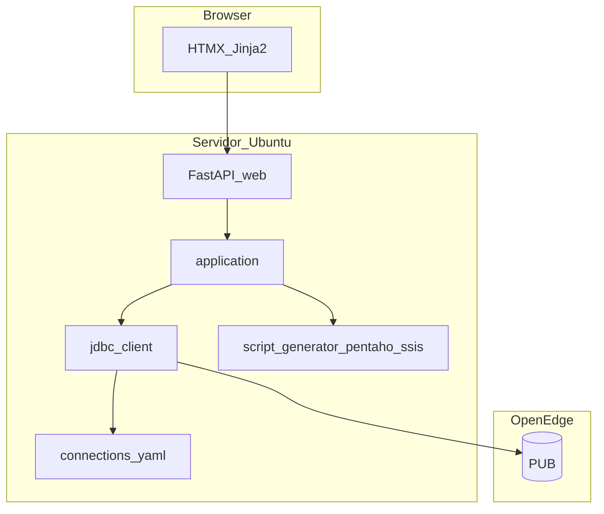

# TODO — Totvs Helper

Roadmap em **duas fases**. A ordem é fixa: **Fase 1 (SSIS) no desktop** → **Fase 2 (web) em entrega única**.

| Fase | Tema | Versão alvo | Como será feito | Status |
|------|------|-------------|-----------------|--------|
| **1** | **Exportação** de carga SSIS (`.dtsx`) | **`2.2.0`** (MINOR) | Incremental (descoberta → exportador → UI → homologação) | **Próximo** |
| **2** | Migração **web** (Ubuntu + JDBC + HTMX) | **`3.0.0`** (MAJOR) | **Entrega única** (gerada pelo Cursor de uma vez) | Planejado |

---

## Versionamento e repositório

Decisões alinhadas a [CONVENTIONS.md](docs/ai/CONVENTIONS.md#versionamento) e validadas com o time:

| Decisão | Escolha |
|---------|---------|
| **Repositório** | **Manter o atual** — Fase 2 evolui o mesmo `totvs_helper/`; não criar repo paralelo “Totvs Helper Web”. |
| **Nome do produto** | Continua **Totvs Helper** (não “Web 1.0” como linha semver separada). |
| **Versão desktop final** | **`2.2.0`** — última release com `.exe`, após Fase 1 (SSIS) estável. |
| **Versão web (cutover)** | **`3.0.0`** — breaking change (desktop → web); bump MAJOR único na entrega da Fase 2. |
| **Código desktop após 3.0** | **Removido** do tree ativo (`ui/`, PyInstaller, ODBC); **sem** pasta `legacy/` no `main`. |
| **Consultar versão antiga** | **Git** — tag anotada no último desktop (ex.: `v2.2.0` ou `v2.2.0-desktop-final`); `git checkout` / `git show` para inspecionar ou rodar; branch `desktop/2.x` só se hotfix raro. |
| **Cutover operacional** | Último `.exe` na pasta de rede; README e CHANGELOG apontam a tag da última versão desktop. |

Sequência esperada: **`2.1.5`** (atual) → **`2.2.0`** (Fase 1) → **`3.0.0`** (Fase 2).

---

## O que já existe vs. o que falta

| Capacidade | Hoje (v2.1.x) | Fase 1 (`2.2.0`) | Fase 2 (`3.0.0` web) |
|------------|---------------|------------------|----------------------|
| Wizard DSN → tabela → scripts | Sim (desktop) | — | **Paridade obrigatória** |
| Scripts SQL (ETL, DDL, UPDATE, DELETE) | Sim | — | Web |
| Expressão **diferencial SSIS** (aba + copiar/salvar) | Sim (`ScriptGenerator.differential`) | Usada dentro do `.dtsx` | Web |
| Toggles **campos livres** / **multi-empresa** / **ECOM** | Sim | — | Web |
| Pré-visualização (metadados, amostra TOP, índices) | Sim | — | Web |
| Regenerar scripts ao alterar toggles | Sim | — | Web |
| Exportação **Pentaho** (`.kjb` / `.ktr`) | Sim | — | Web (ZIP download) |
| Exportação Pentaho a partir do **histórico** (metadados persistidos) | Sim (v2.1.5) | — | Web |
| Exportação **SSIS** (`.dtsx`) | **Não** | **Objetivo da Fase 1** | Web (ZIP ou `.dtsx` download) |
| **Histórico** (até 20 gerações, restaurar sessão) | Sim (v2.1.5, `%APPDATA%`) | — | Web (persistência documentada; ver checklist) |
| App desktop `.exe` | Sim | Mantém até Fase 2 | **Substituído** |

A Fase 1 não é “criar SQL para SSIS” (isso já existe) — é **exportar o pacote SSIS completo**, no mesmo espírito do botão **Gerar carga Pentaho**.

A Fase 2 **não** é MVP parcial: a web deve oferecer **todas** as funções do desktop na versão **`2.2.0`** (incluindo histórico, exports Pentaho/SSIS e toggles), antes do cutover.

---

## Fase 1 — Exportação de carga SSIS

### Objetivo

Permitir **exportar** um pacote SSIS (`.dtsx`, e opcionalmente `.dtproj`) a partir dos metadados e scripts da sessão, com **botão na tela de resultados** e templates versionados no repositório.

### Contexto e decisões

- **Referência:** [`services/pentaho/`](src/totvs_helper/services/pentaho/) + [`docs/ai/PENTAHO.md`](docs/ai/PENTAHO.md).
- **Entrada:** `FieldMeta`, PK, `include_free_fields`, `multi_company`, DSN/família, `GeneratedScripts` (inclui `differential`).
- **Saída:** arquivo(s) na pasta escolhida pelo usuário — **exportação**, não execução no SSIS.
- **Escopo:** modo **sync** (sem truncate full), alinhado ao Pentaho.

### Arquitetura alvo

```text
ResultsScreen  →  [Gerar carga SSIS]
       ↓
app_window._generate_ssis_load()
       ↓
AppActions.generate_ssis()
       ↓
SsisExporter  →  packaging/ssis/templates/.../TEMPLATE.dtsx
       ↓
pasta escolhida  →  wkf ou pacote .dtsx pronto para SSDT
```

### O que reaproveita

| Peça | Uso |
|------|-----|
| [`ScriptGenerator`](src/totvs_helper/services/script_generator.py) | `query_etl`, `differential`, DDL/DML |
| [`pentaho/constants.py`](src/totvs_helper/services/pentaho/constants.py) | Família DSN, multi vs não multi |
| [`pentaho/sql.py`](src/totvs_helper/services/pentaho/sql.py) | `format_entity_name`, SQL Table Input |
| [`ecom_emitente_keys.py`](src/totvs_helper/services/ecom_emitente_keys.py) | Remapeamento ECOM `emitente` (reutilizar no export SSIS) |
| [`FieldMeta`](src/totvs_helper/infra/odbc_client.py) | Colunas e PK no Data Flow |
| [`PentahoExporter`](src/totvs_helper/services/pentaho/exporter.py) | Padrão clone template + injeção XML |

### Plano de ação (Fase 1 — etapas sequenciais)

#### Etapa 1 — Descoberta e template de referência

**Bloqueante:** sem `.dtsx` de referência da Britânia, não avançar para o exportador.

- [ ] Obter pacote SSIS **de referência** (1 tabela multi-empresa + 1 não multi).
- [ ] Mapear conexões: origem OpenEdge, destino `STAGE` / schema `tot`.
- [ ] Mapear componentes: origem SQL, destino OLE DB, Conditional Split (`differential`), Execute SQL (DDL).
- [ ] Definir placeholders no XML (entidade, SQL, colunas, PK, EMPRESA/BASE).
- [ ] **Go/no-go:** template abre no SSDT com substituições manuais.

#### Etapa 2 — Templates versionados (`packaging/ssis/`)

- [ ] Criar `packaging/ssis/templates/` espelhando perfis Pentaho:
  - `multi_esp2unit`, `multi_ems2unit`
  - `non_multi_wms`, `non_multi_esp2corp`
- [ ] Documentar versão alvo SSDT / SQL Server Integration Services.

#### Etapa 3 — Serviço de exportação (`services/ssis/`)

Núcleo da Fase 1: **gerar o artefato `.dtsx`**.

- [ ] `services/ssis/constants.py` — templates por família (reutilizar `pentaho/constants` onde couber).
- [ ] `services/ssis/sql.py` — SQL embutido no pacote (delegar a `pentaho/sql` quando possível).
- [ ] `services/ssis/fields.py` — tipos e colunas no Data Flow SSIS.
- [ ] `services/ssis/exporter.py` — `SsisExporter.generate()`:
  - escolher template por família / flags;
  - injetar SQL, `differential`, metadados, nome `tot.{Entidade}`;
  - gravar `.dtsx` (e paths relativos) em `output_dir`.
- [ ] Incluir templates no build frozen ([`totvs_helper.spec`](totvs_helper.spec), [`paths.py`](src/totvs_helper/paths.py)).
- [ ] Testes: `xml.etree` + golden em `tests/expected/ssis/`; `tests/test_ssis_exporter.py`.

#### Etapa 4 — Exportação na UI (desktop)

Expor a exportação ao usuário (paridade com Pentaho).

- [ ] `AppActions.generate_ssis()` — espelhar `generate_pentaho()`.
- [ ] `app_window._generate_ssis_load()` — thread + pasta + erros.
- [ ] Botão **Gerar carga SSIS** em [`ResultsScreen`](src/totvs_helper/ui/screens/results_screen.py).
- [ ] Diálogo de pasta ([`tk_dialogs.py`](src/totvs_helper/ui/tk_dialogs.py)); toast com caminho do `.dtsx`.
- [ ] [`CHANGELOG.md`](CHANGELOG.md) + [`docs/ai/SSIS.md`](docs/ai/SSIS.md).

#### Etapa 5 — Homologação

- [ ] Validar 2–3 tabelas de referência (mesmas do Pentaho).
- [ ] Abrir `.dtsx` no SSDT: conexões, Data Flow, expressão diferencial.
- [ ] Atualizar [`AGENTS.md`](AGENTS.md) e [`docs/ai/ARCHITECTURE.md`](docs/ai/ARCHITECTURE.md).
- [ ] Fechar release desktop **`2.2.0`**: [`CHANGELOG.md`](CHANGELOG.md), `bump_version.py`, tag Git **`v2.2.0`** (última versão `.exe` antes da Fase 2).

### Fora do escopo (Fase 1)

- Executar pacotes SSIS dentro do Totvs Helper
- Editor visual de `.dtsx`
- Deploy no SSIS Catalog / SQL Agent
- Versão web (Fase 2)

### Riscos (Fase 1)

| Risco | Mitigação |
|-------|-----------|
| XML `.dtsx` frágil | Testes golden + validação SSDT |
| Conexão SSIS ≠ ODBC desktop | Copiar strings dos pacotes existentes na Britânia |
| Multi-empresa (5 fontes) | `MULTI_BRANCHES` do Pentaho |

---

## Fase 2 — Migração web (entrega única)

### Objetivo

Substituir o app desktop por **aplicação web** no **Ubuntu** (mesmo servidor do Pentaho), com **JDBC DataDirect**, **FastAPI + HTMX**, **paridade funcional completa** com o desktop **`2.2.0`** e exportação **Pentaho + SSIS** em download. Release: **`3.0.0`** (MAJOR).

### Como será executada

- **Uma única entrega de código** pelo Cursor (não há sub-sprints 2.0, 2.1, …).
- O checklist abaixo é o **escopo fechado** dessa entrega; itens marcados `[humano]` são validação/deploy após o merge.
- **Pré-requisito:** Fase 1 concluída (`services/ssis/` estável no desktop, versão **`2.2.0`** taggeada).
- **Pré-requisito infra** `[humano]` antes de rodar em produção: `.jar` DataDirect, `connections.yaml`, JRE, rede até OpenEdge.
- **Sem pasta `legacy/`** — código desktop removido do `main`; histórico via Git (tag `v2.2.0`).

### Paridade obrigatória (desktop `2.2.0` → web `3.0.0`)

Tudo abaixo deve existir na web antes do cutover. Referência de comportamento: `ui/app_window.py`, `ui/app_actions.py`, `ui/history_store.py`.

| Área | Desktop (referência) | Web (entrega 3.0.0) |
|------|----------------------|---------------------|
| Conexões | Lista DSN ODBC + busca | Lista conexões do `connections.yaml` + busca HTMX |
| Tabela | Busca, toggles campos livres / multi / ECOM | Mesmos toggles; defaults por família (`is_multi_company_dsn`) |
| Preview | Metadados, amostra (TOP, limite colunas), índices | Partial HTMX equivalente |
| Scripts | Abas ETL, diferencial SSIS, DDL, UPDATE, DELETE | Mesmas abas; highlight Pygments |
| Scripts | Copiar / salvar TXT; regenerar ao mudar toggle | Equivalente na UI web |
| Pentaho | Botão **Gerar carga Pentaho** → pasta escolhida | `POST /pentaho/export` → ZIP download |
| Pentaho | Export a partir de entrada do histórico (metadados + reconexão) | Mesma capacidade |
| SSIS | Botão **Gerar carga SSIS** (pós-Fase 1) | `POST /ssis/export` → ZIP ou `.dtsx` |
| Histórico | Até **20** entradas; uma por tabela; restaurar scripts + flags | Paridade (persistência server-side documentada; ver nota abaixo) |
| Histórico | Metadados de colunas persistidos (Pentaho/SSIS) | Paridade |
| Navegação | Wizard + painel histórico + novo processo | Fluxo equivalente no browser |
| Feedback | Toasts + barra de status (erros/sucessos) | Mensagens HTMX equivalentes |

**Histórico na web:** no desktop persiste em `%APPDATA%\TotvsHelper\history.json`. Na web, definir store (arquivo no servidor, DB ou Redis) com **mesmo limite (20)** e **mesma semântica** (última geração por par conexão+tabela; restauração com scripts, flags e metadados). Documentar no guia de deploy.

### Contexto e decisões

| Decisão | Escolha |
|---------|---------|
| SO | Ubuntu (servidor de aplicação) |
| Banco | JDBC DataDirect (`com.ddtek.jdbc.openedge.OpenEdgeDriver`) — igual aos [templates Pentaho](packaging/pentaho/templates/) |
| Frontend | HTMX + Jinja2 |
| Repositório | **Mesmo** — substitui desktop in-place; tag `v2.2.0` para último `.exe` |
| Versão | **`3.0.0`** — MAJOR; CHANGELOG com **Removido** (desktop) e **Adicionado** (web) |
| Desktop | Removido na mesma entrega (`ui/`, PyInstaller, ODBC) — **sem** `legacy/` |
| Conexões | `connections.yaml` no servidor (substitui DSNs locais) |

### Arquitetura alvo



### Checklist único — entrega Fase 2 (Cursor)

Marque tudo nesta lista na **mesma** implementação (branch/PR).

#### Núcleo e dados

- [ ] `infra/models.py` — `FieldMeta`, `TableIndexRow` (extraídos de `odbc_client`).
- [ ] `infra/openedge_client.py` — protocolo de acesso OpenEdge.
- [ ] `infra/jdbc_client.py` — paridade com [`odbc_client.py`](src/totvs_helper/infra/odbc_client.py) (mesmas queries/fallbacks).
- [ ] `config/connections.example.yaml` + loader; credenciais no `.env`.
- [ ] `config/settings.py` — `TOTVS_JDBC_JAR_PATH`, driver, timeout, path do YAML.
- [ ] `application/app_actions.py` + `application/session.py` (migrados de `ui/`).
- [ ] `errors.py` — `ConnectionError` genérico (ou renomear `OdbcConnectionError`).
- [ ] `scripts/jdbc_spike.py` — validação local/servidor do jar.
- [ ] Testes: mocks + `pytest -m jdbc` opcional; `test_app_actions` atualizado.

#### Web (paridade com wizard desktop — ver tabela acima)

- [ ] `src/totvs_helper/web/` — FastAPI, rotas, `requirements-web.txt`.
- [ ] `GET /` — listar conexões (busca HTMX).
- [ ] `POST /connect/{id}` — sessão + tabelas.
- [ ] `GET /tables` — busca; toggles **campos livres**, **multi-empresa**, **ECOM**; defaults por família de conexão.
- [ ] `GET /tables/{name}/preview` — partial: metadados, amostra (limite colunas/PK como ODBC), índices.
- [ ] `POST /scripts/generate` — abas SQL (ETL, diferencial SSIS, DDL, UPDATE, DELETE); copiar/salvar.
- [ ] Regeneração de scripts ao alterar toggles (mesmo comportamento do desktop).
- [ ] `POST /pentaho/export` — ZIP download (sessão atual e **restauração do histórico**).
- [ ] `POST /ssis/export` — ZIP ou `.dtsx` download.
- [ ] `GET /history` — listar até **20** gerações; restaurar scripts, flags e metadados de colunas.
- [ ] Persistência do histórico no servidor (store documentado; paridade com `history_store.py`).
- [ ] Sessão (cookie assinado; documentar Redis se multi-instância).
- [ ] Templates HTMX + highlight SQL (Pygments no servidor).
- [ ] Erros: `user_message_for()` + feedback HTMX (equivalente a toasts/barra de status).
- [ ] `scripts/run_web.sh` — uvicorn.

#### Remoção desktop (mesma entrega — sem `legacy/`)

- [ ] Remover `src/totvs_helper/ui/`, splash, `app/main.py` desktop.
- [ ] Remover `totvs_helper.spec`, `scripts/build_exe.ps1`.
- [ ] Remover deps: `customtkinter`, `pyinstaller` de requirements principais.
- [ ] Remover `infra/odbc_client.py` (histórico via tag Git `v2.2.0`, não cópia no tree).
- [ ] Confirmar tag **`v2.2.0`** (criada na Etapa 5 da Fase 1) antes do merge **`3.0.0`**.

#### Documentação

- [ ] [`README.md`](README.md) — web, Ubuntu, JDBC, sem `.exe`; link para tag da última versão desktop.
- [ ] [`AGENTS.md`](AGENTS.md), [`docs/ai/ARCHITECTURE.md`](docs/ai/ARCHITECTURE.md), [`docs/ai/PROJECT_CONTEXT.md`](docs/ai/PROJECT_CONTEXT.md).
- [ ] [`CHANGELOG.md`](CHANGELOG.md) — **`## 3.0.0`**: breaking desktop → web; categorias **Removido** / **Adicionado**.
- [ ] `python scripts/bump_version.py 3.0.0` na entrega.
- [ ] Guia deploy: JRE, jar, systemd/nginx, `connections.yaml`, store do histórico.

#### Validação `[humano]` (após merge)

- [ ] Deploy no Ubuntu com jar/credenciais do Pentaho.
- [ ] Conectar EMS2UNIT / ESP2UNIT / WMS; preview; scripts vs `tests/expected/`.
- [ ] Download ZIP Pentaho (Spoon 9.4) e SSIS (SSDT).
- [ ] Histórico: gerar, fechar browser, reabrir — restaurar e exportar Pentaho/SSIS.
- [ ] Cutover: descontinuar `.exe` na pasta de rede; comunicar tag `v2.2.0` como último desktop.

### Riscos (Fase 2)

| Risco | Mitigação |
|-------|-----------|
| JDBC ≠ ODBC em metadados | Spike no servidor + comparar com desktop antes do cutover |
| Entrega grande | Checklist único; testes automatizados obrigatórios no PR |
| Jar/licença | Reutilizar artefato do Pentaho no mesmo host |
| Sessão JDBC | Conexão por request ou pool com timeout |

### Estrutura final do repositório

```text
src/totvs_helper/
  application/
  config/
  infra/           # models, jdbc_client
  services/        # script_generator, pentaho/, ssis/
  web/
config/
  connections.example.yaml
scripts/
  jdbc_spike.py
  run_web.sh
requirements.txt
requirements-web.txt
```

---

## Histórico

- **2026-05 (inicial):** Roadmap em 2 fases — Fase 1 exportação SSIS (etapas 1–5); Fase 2 web como **entrega única** via Cursor.
- **2026-05 (atualização):** Decisões de **versionamento e repositório** documentadas:
  - Mesmo repositório; **`2.2.0`** = último desktop (Fase 1); **`3.0.0`** = web (Fase 2, MAJOR).
  - **Sem** pasta `legacy/` — consulta ao desktop antigo via **tag Git** (`v2.2.0`).
  - **Paridade obrigatória** web ↔ desktop `2.2.0`: wizard completo, scripts (ETL/DDL/DML/diferencial), toggles (campos livres, multi, ECOM), preview, exports Pentaho e SSIS, histórico (**20** entradas, restauração, export a partir do histórico).
- **Estado do desktop v2.1.5** (baseline para paridade na Fase 2 — ver [CHANGELOG](CHANGELOG.md)):
  - Histórico persistente em `%APPDATA%\TotvsHelper\history.json` (até 20 gerações; uma entrada por tabela).
  - Metadados de colunas no histórico para export Pentaho sem reconectar quando possível.
  - Toggle **ECOM** (chaves emitente) na tela de tabela e scripts (v2.1.4+).
  - Pré-visualização ODBC com limite de colunas e exclusão de blob/binário (tabelas largas).
  - Toasts + barra de status com auto-dismiss e export Pentaho alinhado ao histórico.

