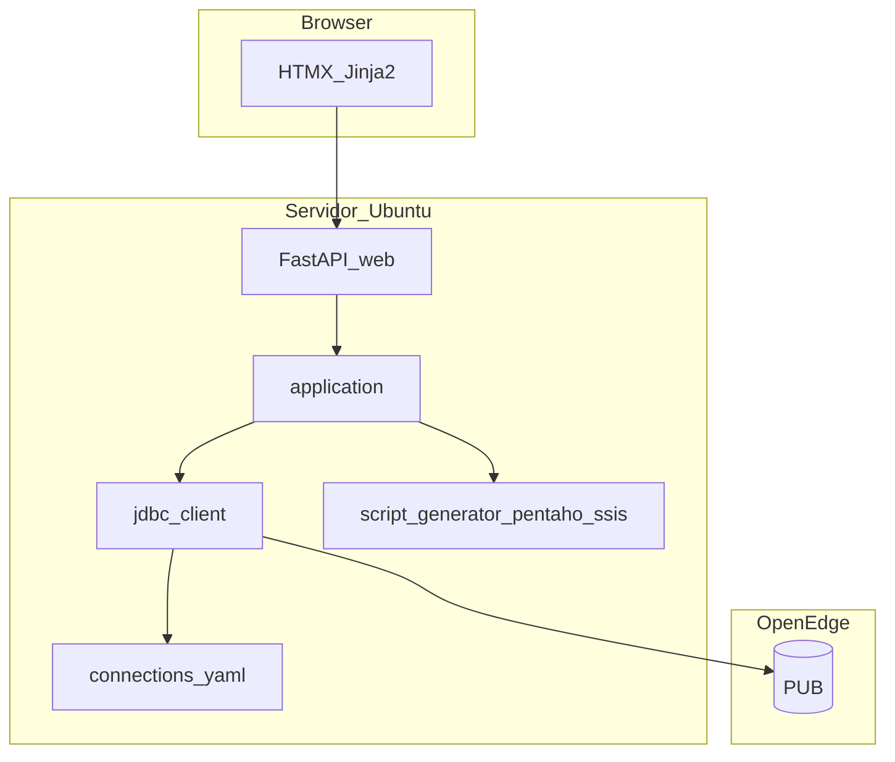

# TODO — Totvs Helper

Roadmap em **duas fases**. A ordem é fixa: **Fase 1 (SSIS) no desktop** → **Fase 2 (web) em entrega única**.

| Fase | Tema | Como será feito | Status |
|------|------|-----------------|--------|
| **1** | **Exportação** de carga SSIS (`.dtsx`) | Incremental (descoberta → exportador → UI → homologação) | **Próximo** |
| **2** | Migração **web** (Ubuntu + JDBC + HTMX) | **Entrega única** (gerada pelo Cursor de uma vez) | Planejado |

---

## O que já existe vs. o que falta

| Capacidade | Hoje (v2.1.x) | Fase 1 | Fase 2 |
|------------|---------------|--------|--------|
| Scripts SQL (ETL, DDL, UPDATE, DELETE) | Sim | — | Web |
| Expressão **diferencial SSIS** (aba + TXT) | Sim (`ScriptGenerator.differential`) | Usada dentro do `.dtsx` | Web |
| Exportação **Pentaho** (`.kjb` / `.ktr`) | Sim | — | Web (ZIP) |
| Exportação **SSIS** (`.dtsx`) | **Não** | **Objetivo da Fase 1** | Web (ZIP) |
| App desktop `.exe` | Sim | Mantém até Fase 2 | **Substituído** |

A Fase 1 não é “criar SQL para SSIS” (isso já existe) — é **exportar o pacote SSIS completo**, no mesmo espírito do botão **Gerar carga Pentaho**.

---

## Fase 1 — Exportação de carga SSIS

### Objetivo

Permitir **exportar** um pacote SSIS (`.dtsx`, e opcionalmente `.dtproj`) a partir dos metadados e scripts da sessão, com **botão na tela de resultados** e templates versionados no repositório.

### Contexto e decisões

- **Referência:** [`services/pentaho/`](src/totvs_helper/services/pentaho/) + [`docs/ai/PENTAHO.md`](docs/ai/PENTAHO.md).
- **Entrada:** `FieldMeta`, PK, `include_free_fields`, `multi_company`, DSN/família, `GeneratedScripts` (inclui `differential`).
- **Saída:** arquivo(s) na pasta escolhida pelo usuário — **exportação**, não execução no SSIS.
- **Escopo:** modo **sync** (sem truncate full), alinhado ao Pentaho.

### Arquitetura alvo

```text
ResultsScreen  →  [Gerar carga SSIS]
       ↓
app_window._generate_ssis_load()
       ↓
AppActions.generate_ssis()
       ↓
SsisExporter  →  packaging/ssis/templates/.../TEMPLATE.dtsx
       ↓
pasta escolhida  →  wkf ou pacote .dtsx pronto para SSDT
```

### O que reaproveita

| Peça | Uso |
|------|-----|
| [`ScriptGenerator`](src/totvs_helper/services/script_generator.py) | `query_etl`, `differential`, DDL/DML |
| [`pentaho/constants.py`](src/totvs_helper/services/pentaho/constants.py) | Família DSN, multi vs não multi |
| [`pentaho/sql.py`](src/totvs_helper/services/pentaho/sql.py) | `format_entity_name`, SQL Table Input |
| [`FieldMeta`](src/totvs_helper/infra/odbc_client.py) | Colunas e PK no Data Flow |
| [`PentahoExporter`](src/totvs_helper/services/pentaho/exporter.py) | Padrão clone template + injeção XML |

### Plano de ação (Fase 1 — etapas sequenciais)

#### Etapa 1 — Descoberta e template de referência

**Bloqueante:** sem `.dtsx` de referência da Britânia, não avançar para o exportador.

- [ ] Obter pacote SSIS **de referência** (1 tabela multi-empresa + 1 não multi).
- [ ] Mapear conexões: origem OpenEdge, destino `STAGE` / schema `tot`.
- [ ] Mapear componentes: origem SQL, destino OLE DB, Conditional Split (`differential`), Execute SQL (DDL).
- [ ] Definir placeholders no XML (entidade, SQL, colunas, PK, EMPRESA/BASE).
- [ ] **Go/no-go:** template abre no SSDT com substituições manuais.

#### Etapa 2 — Templates versionados (`packaging/ssis/`)

- [ ] Criar `packaging/ssis/templates/` espelhando perfis Pentaho:
  - `multi_esp2unit`, `multi_ems2unit`
  - `non_multi_wms`, `non_multi_esp2corp`
- [ ] Documentar versão alvo SSDT / SQL Server Integration Services.

#### Etapa 3 — Serviço de exportação (`services/ssis/`)

Núcleo da Fase 1: **gerar o artefato `.dtsx`**.

- [ ] `services/ssis/constants.py` — templates por família (reutilizar `pentaho/constants` onde couber).
- [ ] `services/ssis/sql.py` — SQL embutido no pacote (delegar a `pentaho/sql` quando possível).
- [ ] `services/ssis/fields.py` — tipos e colunas no Data Flow SSIS.
- [ ] `services/ssis/exporter.py` — `SsisExporter.generate()`:
  - escolher template por família / flags;
  - injetar SQL, `differential`, metadados, nome `tot.{Entidade}`;
  - gravar `.dtsx` (e paths relativos) em `output_dir`.
- [ ] Incluir templates no build frozen ([`totvs_helper.spec`](totvs_helper.spec), [`paths.py`](src/totvs_helper/paths.py)).
- [ ] Testes: `xml.etree` + golden em `tests/expected/ssis/`; `tests/test_ssis_exporter.py`.

#### Etapa 4 — Exportação na UI (desktop)

Expor a exportação ao usuário (paridade com Pentaho).

- [ ] `AppActions.generate_ssis()` — espelhar `generate_pentaho()`.
- [ ] `app_window._generate_ssis_load()` — thread + pasta + erros.
- [ ] Botão **Gerar carga SSIS** em [`ResultsScreen`](src/totvs_helper/ui/screens/results_screen.py).
- [ ] Diálogo de pasta ([`tk_dialogs.py`](src/totvs_helper/ui/tk_dialogs.py)); toast com caminho do `.dtsx`.
- [ ] [`CHANGELOG.md`](CHANGELOG.md) + [`docs/ai/SSIS.md`](docs/ai/SSIS.md).

#### Etapa 5 — Homologação

- [ ] Validar 2–3 tabelas de referência (mesmas do Pentaho).
- [ ] Abrir `.dtsx` no SSDT: conexões, Data Flow, expressão diferencial.
- [ ] Atualizar [`AGENTS.md`](AGENTS.md) e [`docs/ai/ARCHITECTURE.md`](docs/ai/ARCHITECTURE.md).

### Fora do escopo (Fase 1)

- Executar pacotes SSIS dentro do Totvs Helper
- Editor visual de `.dtsx`
- Deploy no SSIS Catalog / SQL Agent
- Versão web (Fase 2)

### Riscos (Fase 1)

| Risco | Mitigação |
|-------|-----------|
| XML `.dtsx` frágil | Testes golden + validação SSDT |
| Conexão SSIS ≠ ODBC desktop | Copiar strings dos pacotes existentes na Britânia |
| Multi-empresa (5 fontes) | `MULTI_BRANCHES` do Pentaho |

---

## Fase 2 — Migração web (entrega única)

### Objetivo

Substituir o app desktop por **aplicação web** no **Ubuntu** (mesmo servidor do Pentaho), com **JDBC DataDirect**, **FastAPI + HTMX**, paridade funcional do wizard atual e exportação **Pentaho + SSIS** em download.

### Como será executada

- **Uma única entrega de código** pelo Cursor (não há sub-sprints 2.0, 2.1, …).
- O checklist abaixo é o **escopo fechado** dessa entrega; itens marcados `[humano]` são validação/deploy após o merge.
- **Pré-requisito:** Fase 1 concluída (`services/ssis/` estável no desktop).
- **Pré-requisito infra** `[humano]` antes de rodar em produção: `.jar` DataDirect, `connections.yaml`, JRE, rede até OpenEdge.

### Contexto e decisões

| Decisão | Escolha |
|---------|---------|
| SO | Ubuntu (servidor de aplicação) |
| Banco | JDBC DataDirect (`com.ddtek.jdbc.openedge.OpenEdgeDriver`) — igual aos [templates Pentaho](packaging/pentaho/templates/) |
| Frontend | HTMX + Jinja2 |
| Desktop | Removido na mesma entrega (`ui/`, PyInstaller, ODBC) |
| Conexões | `connections.yaml` no servidor (substitui DSNs locais) |

### Arquitetura alvo



### Checklist único — entrega Fase 2 (Cursor)

Marque tudo nesta lista na **mesma** implementação (branch/PR).

#### Núcleo e dados

- [ ] `infra/models.py` — `FieldMeta`, `TableIndexRow` (extraídos de `odbc_client`).
- [ ] `infra/openedge_client.py` — protocolo de acesso OpenEdge.
- [ ] `infra/jdbc_client.py` — paridade com [`odbc_client.py`](src/totvs_helper/infra/odbc_client.py) (mesmas queries/fallbacks).
- [ ] `config/connections.example.yaml` + loader; credenciais no `.env`.
- [ ] `config/settings.py` — `TOTVS_JDBC_JAR_PATH`, driver, timeout, path do YAML.
- [ ] `application/app_actions.py` + `application/session.py` (migrados de `ui/`).
- [ ] `errors.py` — `ConnectionError` genérico (ou renomear `OdbcConnectionError`).
- [ ] `scripts/jdbc_spike.py` — validação local/servidor do jar.
- [ ] Testes: mocks + `pytest -m jdbc` opcional; `test_app_actions` atualizado.

#### Web (paridade com wizard desktop)

- [ ] `src/totvs_helper/web/` — FastAPI, rotas, `requirements-web.txt`.
- [ ] `GET /` — listar conexões (busca HTMX).
- [ ] `POST /connect/{id}` — sessão + tabelas.
- [ ] `GET /tables` — busca, toggles campos livres / multi-empresa.
- [ ] `GET /tables/{name}/preview` — partial: metadados, amostra, índices.
- [ ] `POST /scripts/generate` — abas SQL (ETL, diferencial SSIS, DDL, UPDATE, DELETE).
- [ ] `POST /pentaho/export` — ZIP download.
- [ ] `POST /ssis/export` — ZIP ou `.dtsx` download.
- [ ] `GET /history` — últimas 10 gerações na sessão.
- [ ] Sessão (cookie assinado; documentar Redis se multi-instância).
- [ ] Templates HTMX + highlight SQL (Pygments no servidor).
- [ ] Erros: `user_message_for()` + feedback HTMX.
- [ ] `scripts/run_web.sh` — uvicorn.

#### Remoção desktop (mesma entrega)

- [ ] Remover `src/totvs_helper/ui/`, splash, `app/main.py` desktop.
- [ ] Remover `totvs_helper.spec`, `scripts/build_exe.ps1` (ou arquivar em `legacy/`).
- [ ] Remover deps: `customtkinter`, `pyinstaller` de requirements principais.
- [ ] Remover `infra/odbc_client.py` (ou `legacy/` se quiser histórico).

#### Documentação

- [ ] [`README.md`](README.md) — web, Ubuntu, JDBC, sem `.exe`.
- [ ] [`AGENTS.md`](AGENTS.md), [`docs/ai/ARCHITECTURE.md`](docs/ai/ARCHITECTURE.md), [`docs/ai/PROJECT_CONTEXT.md`](docs/ai/PROJECT_CONTEXT.md).
- [ ] [`CHANGELOG.md`](CHANGELOG.md) — breaking: desktop → web.
- [ ] Guia deploy: JRE, jar, systemd/nginx, `connections.yaml`.

#### Validação `[humano]` (após merge)

- [ ] Deploy no Ubuntu com jar/credenciais do Pentaho.
- [ ] Conectar EMS2UNIT / ESP2UNIT / WMS; preview; scripts vs `tests/expected/`.
- [ ] Download ZIP Pentaho (Spoon 9.4) e SSIS (SSDT).
- [ ] Cutover: descontinuar `.exe` na pasta de rede.

### Riscos (Fase 2)

| Risco | Mitigação |
|-------|-----------|
| JDBC ≠ ODBC em metadados | Spike no servidor + comparar com desktop antes do cutover |
| Entrega grande | Checklist único; testes automatizados obrigatórios no PR |
| Jar/licença | Reutilizar artefato do Pentaho no mesmo host |
| Sessão JDBC | Conexão por request ou pool com timeout |

### Estrutura final do repositório

```text
src/totvs_helper/
  application/
  config/
  infra/           # models, jdbc_client
  services/        # script_generator, pentaho/, ssis/
  web/
config/
  connections.example.yaml
scripts/
  jdbc_spike.py
  run_web.sh
requirements.txt
requirements-web.txt
```

---

## Histórico

- **2026-05:** Roadmap em 2 fases — Fase 1 exportação SSIS (etapas 1–5); Fase 2 web como **entrega única** via Cursor.
