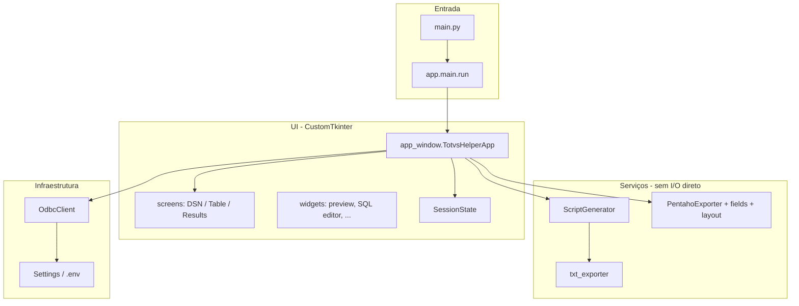

# Contexto do projeto — Totvs Helper

Documento para assistentes de IA entenderem domínio, arquitetura e fluxos de dados. Complementa [README.md](../../README.md) e [AGENTS.md](../../AGENTS.md).

---

## Domínio de negócio

A Britânia opera cargas ETL entre sistemas **TOTVS (Progress/OpenEdge)** e destinos analíticos/operacionais (ex.: SQL Server `stage` / schema `tot`). O Totvs Helper acelera o trabalho do desenvolvedor/analista que:

1. Escolhe um **DSN ODBC** (família `ESP2UNIT`, `EMS2UNIT`, `MOV2UNIT`, `ESP2CORP`, `WMS`, etc.).
2. Escolhe uma **tabela** Progress (`pub."nome-tabela"`).
3. Define opções:
   - **Campos livres** — incluir ou ignorar campos padrão TOTVS (`char-1`, `cod-livre-*`, …) listados em `services/constants.py`.
   - **Multi-empresa** — inclui coluna `empresa` / lógica de 5 fontes; quando desligado, pode usar coluna `BASE` (cargas não multi unificadas).
4. Obtém scripts SQL e, opcionalmente, artefatos **Pentaho** prontos para ajuste no Spoon 9.4.

O helper **infere defaults** de multi-empresa a partir do DSN (`is_multi_company_dsn` em `pentaho_constants.py`).

---

## Arquitetura em camadas



### Princípios

- **UI não contém regras SQL de negócio** — delega a `ScriptGenerator` e `PentahoExporter`.
- **OdbcClient** concentra dialect OpenEdge, fallbacks de metadados e paginação de preview.
- **Estado de sessão** (`SessionState`) é a fonte da verdade entre telas; histórico serializa entradas para restaurar sem reconectar.
- **I/O pesado** (ODBC, escrita de arquivos Pentaho) roda em **worker thread**; UI atualiza via `queue` + `after()` do Tk.

---

## Fluxo da aplicação (usuário)

| Etapa | Tela | Ações principais |
|-------|------|------------------|
| 1 | `DsnScreen` | Listar DSNs, buscar, conectar, carregar lista de tabelas |
| 2 | `TableScreen` | Buscar tabela, toggles campos livres / multi, preview metadados+dados+índices, gerar scripts |
| 3 | `ResultsScreen` | Abas SQL, copiar/salvar, toggles regeneram scripts, **Gerar carga Pentaho** |

Navegação: sidebar + Voltar + Novo processo. Atalhos documentados no README.

**Arquivo central:** `ui/app_window.py` — métodos `_select_dsn`, `_connect_and_load_tables`, `_generate_scripts`, `_regenerate_scripts`, `_generate_pentaho_load`, `_apply_dsn_option_defaults`.

---

## Modelo de dados (metadados ODBC)

Campos retornados como tuplas/seções usadas em todo o pipeline:

```python
# Ordem típica em list_fields_and_pk / preview
(field_name, data_type, width, decimals, fetch_datatype)
# Ex.: ("cod-estabel", "character", 10, 0, "varchar")
```

`pk_fields: list[str]` vem do índice primário OpenEdge (várias queries de fallback em `list_table_indexes`).

**Nome da entidade destino SQL Server / Pentaho:** `progress_table.title().replace("-", "")` → ex. `br-docto-wms` → `BrDoctoWms`.

---

## ScriptGenerator (núcleo SQL)

Arquivo: `services/script_generator.py`

Produz `GeneratedScripts`:

| Campo | Uso |
|-------|-----|
| `query_etl` | SELECT OpenEdge com projeções (substring, datas, logical→bit) |
| `ddl_create` | `CREATE TABLE [tot].[Entidade]` + PK |
| `script_update` / `script_delete` | DML com WHERE em PK (+ empresa ou BASE) |
| `differential` | Expressão SSIS-style para comparar colunas |

Flags:

- `include_free_fields` — filtra `FREE_FIELDS_TO_IGNORE`.
- `multi_company` — coluna `empresa`; se False, pode incluir `BASE` varchar(8) na PK (não multi).

Testes golden em `tests/expected/*.sql` e `tests/test_script_generator.py`.

---

## Pentaho (resumo)

Templates versionados em `packaging/pentaho/templates/`:

| Pasta | Uso |
|-------|-----|
| `multi_esp2unit` | 5 fontes DATASUL_ESP2UNIT_* |
| `multi_ems2unit` | 5 fontes EMS2UNIT + passos SV DATASUL / Select values |
| `non_multi_wms` | WMS + WMS_ECOM, campo BASE |
| `non_multi_esp2corp` | ESP2CORP + ECOM |

Pipeline de export (`PentahoExporter.generate`):

1. Escolhe template por família do DSN (`detect_source_family`).
2. Substitui entidade/tabela nos XMLs (`_replace_entity`).
3. Injeta SQL em cada TableInput (`build_pentaho_table_input_sql`).
4. Reconstrói metadados de colunas em todos os passos (`apply_field_metadata` em `pentaho_fields.py`).
5. Aplica layout Spoon (`apply_ktr_gui_layout` em `pentaho_layout.py`).
6. Normaliza job (`normalize_job_transformation_entry`).

Detalhes: [PENTAHO.md](PENTAHO.md).

---

## Configuração e logs

- **Settings:** `config/settings.py` lê `.env` (usuário/senha ODBC, timeout).
- **Logs:** `%APPDATA%\TotvsHelper\logs\totvs_helper.log` (rotating).
- **Preferências UI:** `ui/preferences.py` (tema, pasta export) — JSON em AppData.

---

## Empacotamento

- `totvs_helper.spec` — dados: templates Pentaho, assets, `.env` embutido no build.
- `scripts/build_exe.ps1` — gera ícone `.ico`, invoca PyInstaller.
- Frozen: `sys.frozen` / `sys._MEIPASS` — templates Pentaho em `packaging/pentaho/templates` via `_default_template_root()`.

---

## Roadmap

Ver [TODO.md](../../TODO.md). Próxima feature planejada: **geração de carga SSIS** (`.dtsx`), seguindo o padrão serviço + botão na `ResultsScreen` + templates versionados.

---

## Glossário

| Termo | Significado |
|-------|-------------|
| DSN | Data Source Name ODBC OpenEdge |
| Multi-empresa | Uma única tabela `tot.*` com coluna `EMPRESA` (5 estabelecimentos) |
| Não multi | Coluna `BASE` (ex. VAREJO/ECOM) unifica origens |
| Stage | Conexão MSSQL `STAGE` nos KTR (destino da sync) |
| Sync | Apenas `MergeRows` + `SynchronizeAfterMerge` (sem truncate full) |
